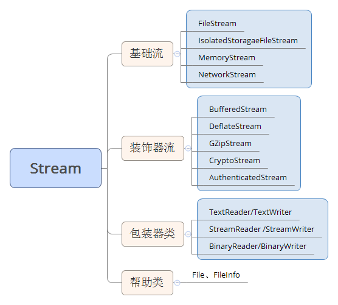

# 流

**TextReader/TextWriter**  
和流没有一点关系，定义了一组通用的、读取和写入字符的方式。  
**StringReader/StringWriter**    
继承自TextReader与TextWriter，它们用于处理字符串，而不是流。  
**StreamReader/StreamWriter**  
继承自TextReader与TextWriter，用于读取文件。  
**BinaryReader/BinaryWriter**  
应用的更广泛一些，用于读取和写入文本字符的场合。  
**帮助类**  
如提供的一写诸如File.ReadAllLines、ReadAllBytes等File抽象类提供的一些静态方法。FileInfo、Directory、DirectoryInfo等用来处理文件夹。
