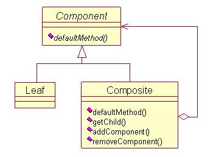

# 组合模式 Composite

**意图**  
将对象组合成树形结构以表示“部分-整体”的层次结构。Composite使得用户对单个对象和组合对象的使用具有一致性。  
**适用性**  
你想表示对象的部分-整体层次结构。  
你希望用户忽略组合对象与单个对象的不同，用户将统一地使用组合结构中的所有对象。  
**分类**  
组合模式分为安全的与透明的。  
一种是在Component中声明所有管理子类对象的方法，这样叶子节点和分支无区别，即透明性，但实际叶子节点是没有子节点的，这会带来一定的安全问题；另一种方式就是只在Component中声明叶子节点与分支节点共有的部分，而分支节点类中定义相关操作子结点的接口，这样在实际的代码中，需要区分节点类型，从而进行相应操作，虽然解决了安全性问题，但失去了透明性。安全性的组合模式类图如下：  

注：透明的组合模式使用更广泛，在叶子节点中空处理或报异常信息解决。